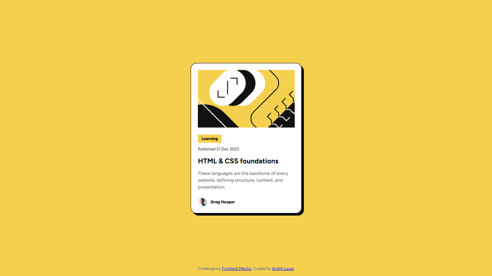
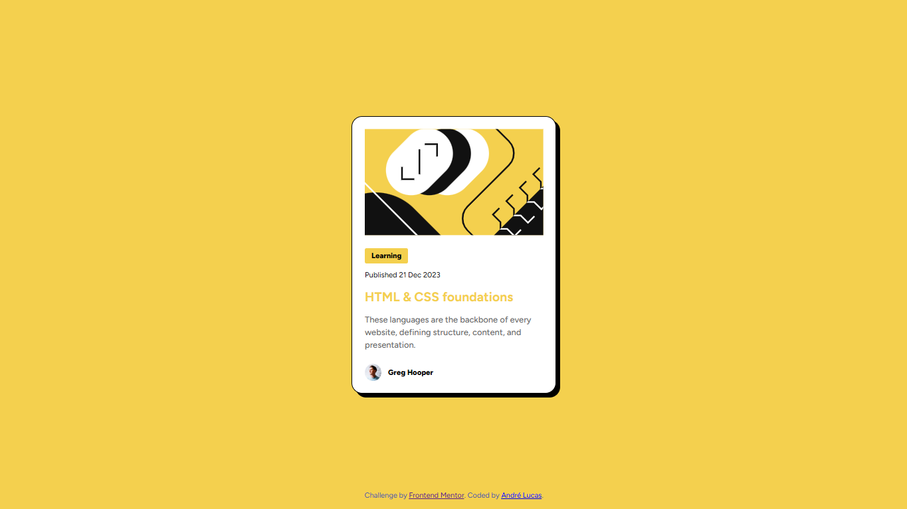

# Frontend Mentor - Blog preview card solution

This is a solution to the [Blog preview card challenge on Frontend Mentor](https://www.frontendmentor.io/challenges/blog-preview-card-ckPaj01IcS). 

## Table of contents

- [Overview](#overview)
  - [The challenge](#the-challenge)
  - [Screenshots](#screenshots)
  - [Links](#links)
- [My process](#my-process)
  - [Built with](#built-with)
  - [What I learned](#what-i-learned)
- [Author](#author)

## Overview

### The challenge

Users should be able to:

- See the hover state for the h1 element "HTML & CSS foundations", which turns it to yellow and changes the cursor to a pointer.

### Screenshots

#### Disabled state screenshot



#### Enabled state screenshot



### Links

- Solution URL: [https://github.com/AndreLucas23/blog-preview-card.git](https://github.com/AndreLucas23/blog-preview-card.git)
- Live Site URL: [https://blog-preview-card-liart-eta.vercel.app/](https://blog-preview-card-liart-eta.vercel.app/)

## My process

### Built with

- Semantic HTML5 markup
- CSS custom properties
- CSS Flexbox
- CSS Pseudo-classes
- Mobile-first workflow

### What I learned

- Semantic way of structuring HTML files

```html
<main>
  <h1>
    Main title
  </h1>
  <div>
    Main content
  </div>
  <footer>
    Main footer
  </footer>
</main>
```

This helps visually impaired users to be able to understand and use the page and indicates SEO good standards.

- CSS pseudo-classes on managing cursors

```css
h1:rover {
  cursor: pointer;
}
```

## Author

- Frontend Mentor - [@AndreLucas23](https://www.frontendmentor.io/profile/AndreLucas23)
- Linkedin - [André Lima](https://www.linkedin.com/in/andr%C3%A9-lima-6a03a6304/)
